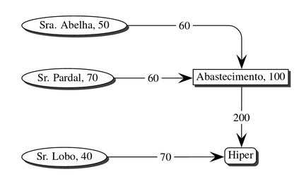

# [ASA] Análise e Sintese de Algoritmos - Project 2

### Description 
This repository contains the second project of Analysis and Synthesis of Algorithms course.  
  
It's a program that solves this problem (but in large scales):  
  
  
  
"In this case Ms. Abelha's plant produces 50 kg of honey, Mr. Pardal's orchard 70 kg of fruit and Mr. Wolf 40 kg of meat. The network can carry 60 kg between the factory of Ms. Abelha and the gas station. This station can only process 100 Kg. 
It is possible to transport 60 kg between Mr. Pardal's orchard and the gas station. It's possible carry 200 Kg between the gas station and the Hyper. Finally it is possible to transport 70 kg between Mr. Wolf's killer and the Hyper. In this case the maximum network capacity is only 140 Kg, and the suppliers produce 160 Kg. Therefore Mr. Caracol you need to increase the capacity of your network, in particular you need to increase the capacity from the filling station. For example if you can increase this station to 110kg this will increase the network capacity to 150 Kg. Note that if Mr. Lobo's production increase to 70 kg this would be supported by the transport network, however this limitation is relative to a supplier and not to the transmission network, so the application should not report this typeof information."
  

### Running
  
Run in terminal: `./main.run`
  
  
##### Input
  
`f e t` - **f** nº suppliers; **e** nº stations ; **t** nº connections  
`F1 F2 F3 ... Ff` - **Fi** production of each supplier (the **f** in `Ff` is the nº of suppliers)  
`E1 E2 ... Ee` - **Ei** capacity of each station (the **e** in `Ee` is the nº of stations)  
`o1 d1 c1` |  
`o2 d2 c2` | -> each line is a connection (**t** in `ot dt ct` is the nº of connections)  
`o3 d3 c3` | -> **oi** origin of the connection  
`o4 d4 c4` | -> **di** destination of the connection  
`(. . . )` | -> **ci** cost of the connection  
`ot dt ct` |  

###### Example of input
```
3 1 4
50 70 40
100
2 5 60
3 5 60
4 1 70
5 1 200
```

##### Output 
  
`C` - **C** max network capacity  
`nE1 nE2 ... nEk` **nEi** is the the number of the Station **i** that could be maxed (sorted by number)  
`o1 d1 c1` |  
`o2 d2 c2` | -> Connections to be maxed  
`(. . . )` | -> **oi** **di** **ci** is the same as the input  
`oj dj cj` |  

###### Example of output (relative to input example)
```
140
5
```

#### More examples and tests in larger scale in 
  
#### More info of the project in  
  
